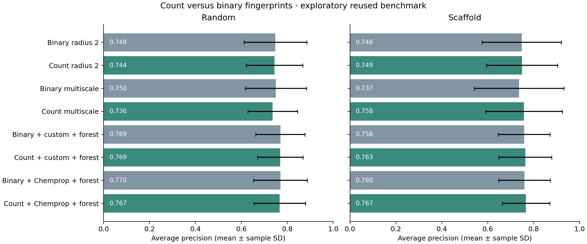

# Count fingerprints: controlled exploratory results

The predeclared primary comparison, **count versus binary multiscale Tanimoto SVM on scaffold AP**, changed by **+0.0211** on average; **4/5** seeds improved. This reused benchmark cannot establish independent generalization or superiority to the original drug-discovery paper.

Counts preserve repeated molecular environments. The exact dot-product Tanimoto kernel follows the established formulation discussed by [Tripp et al. (2023)](https://arxiv.org/html/2306.14809v2); the experimental choice and code are project-specific. We do not use their implementation or reproduce their approximation experiments. Read the [protocol](../../docs/COUNT_PROTOCOL.md).

The count and binary families use the same eight settings, exact grouped inner folds, training-only sigmoid calibration, and outer splits. No neural model was retrained; ensemble members still have equal weights. Every result is retained, including regressions. No new default is selected from these test results.

## Complete results

| Split | Model | AP | ROC-AUC | P@20 | Brier |
| --- | --- | --- | --- | --- | --- |
| random | Class prior | 0.052 ± 0.000 | 0.500 ± 0.000 | 0.052 ± 0.000 | 0.050 ± 0.000 |
| random | Original compact | 0.310 ± 0.097 | 0.744 ± 0.099 | 0.330 ± 0.104 | 0.045 ± 0.002 |
| random | Descriptors only | 0.537 ± 0.054 | 0.874 ± 0.046 | 0.340 ± 0.065 | 0.035 ± 0.003 |
| random | Compact + descriptors (30 epochs) | 0.555 ± 0.095 | 0.851 ± 0.056 | 0.360 ± 0.074 | 0.036 ± 0.003 |
| random | Compact + descriptors (60 epochs) | 0.698 ± 0.090 | 0.914 ± 0.069 | 0.460 ± 0.042 | 0.028 ± 0.006 |
| random | Validation-selected combination | 0.699 ± 0.085 | 0.896 ± 0.049 | 0.430 ± 0.045 | 0.027 ± 0.005 |
| random | Fixed random forest | 0.716 ± 0.136 | 0.906 ± 0.050 | 0.420 ± 0.091 | 0.025 ± 0.007 |
| random | Chemprop reference | 0.723 ± 0.092 | 0.892 ± 0.089 | 0.450 ± 0.035 | 0.025 ± 0.004 |
| random | Tanimoto SVM (radius 2) | 0.748 ± 0.137 | 0.909 ± 0.075 | 0.460 ± 0.082 | 0.024 ± 0.007 |
| random | Tanimoto SVM (radii 2 + 3) | 0.750 ± 0.133 | 0.918 ± 0.072 | 0.480 ± 0.076 | 0.023 ± 0.007 |
| random | Kernel + custom graph + forest | 0.769 ± 0.107 | 0.926 ± 0.066 | 0.470 ± 0.057 | 0.023 ± 0.006 |
| random | Kernel + Chemprop + forest | 0.770 ± 0.117 | 0.923 ± 0.071 | 0.460 ± 0.065 | 0.023 ± 0.005 |
| random | Chemprop + forest | 0.759 ± 0.108 | 0.918 ± 0.067 | 0.460 ± 0.065 | 0.024 ± 0.005 |
| random | Count Tanimoto SVM (radius 2) | 0.744 ± 0.123 | 0.910 ± 0.068 | 0.470 ± 0.076 | 0.025 ± 0.007 |
| random | Count Tanimoto SVM (radii 2 + 3) | 0.736 ± 0.108 | 0.910 ± 0.065 | 0.450 ± 0.061 | 0.025 ± 0.006 |
| random | Count kernel + custom graph + forest | 0.769 ± 0.099 | 0.923 ± 0.065 | 0.490 ± 0.042 | 0.024 ± 0.006 |
| random | Count kernel + Chemprop + forest | 0.767 ± 0.112 | 0.921 ± 0.069 | 0.460 ± 0.065 | 0.023 ± 0.005 |
| scaffold | Class prior | 0.052 ± 0.000 | 0.500 ± 0.000 | 0.052 ± 0.000 | 0.050 ± 0.000 |
| scaffold | Original compact | 0.232 ± 0.096 | 0.767 ± 0.143 | 0.230 ± 0.097 | 0.046 ± 0.003 |
| scaffold | Descriptors only | 0.524 ± 0.158 | 0.867 ± 0.078 | 0.390 ± 0.096 | 0.036 ± 0.007 |
| scaffold | Compact + descriptors (30 epochs) | 0.580 ± 0.137 | 0.870 ± 0.091 | 0.420 ± 0.104 | 0.033 ± 0.004 |
| scaffold | Compact + descriptors (60 epochs) | 0.661 ± 0.115 | 0.928 ± 0.051 | 0.420 ± 0.084 | 0.034 ± 0.004 |
| scaffold | Validation-selected combination | 0.731 ± 0.143 | 0.923 ± 0.049 | 0.430 ± 0.084 | 0.028 ± 0.007 |
| scaffold | Fixed random forest | 0.746 ± 0.089 | 0.932 ± 0.033 | 0.450 ± 0.061 | 0.025 ± 0.005 |
| scaffold | Chemprop reference | 0.717 ± 0.129 | 0.933 ± 0.043 | 0.420 ± 0.097 | 0.027 ± 0.007 |
| scaffold | Tanimoto SVM (radius 2) | 0.748 ± 0.172 | 0.924 ± 0.052 | 0.460 ± 0.114 | 0.026 ± 0.009 |
| scaffold | Tanimoto SVM (radii 2 + 3) | 0.737 ± 0.195 | 0.925 ± 0.066 | 0.450 ± 0.132 | 0.027 ± 0.010 |
| scaffold | Kernel + custom graph + forest | 0.758 ± 0.113 | 0.942 ± 0.033 | 0.450 ± 0.071 | 0.025 ± 0.006 |
| scaffold | Kernel + Chemprop + forest | 0.760 ± 0.112 | 0.943 ± 0.029 | 0.470 ± 0.045 | 0.023 ± 0.007 |
| scaffold | Chemprop + forest | 0.750 ± 0.108 | 0.941 ± 0.025 | 0.470 ± 0.045 | 0.024 ± 0.006 |
| scaffold | Count Tanimoto SVM (radius 2) | 0.749 ± 0.155 | 0.907 ± 0.075 | 0.430 ± 0.104 | 0.022 ± 0.008 |
| scaffold | Count Tanimoto SVM (radii 2 + 3) | 0.758 ± 0.166 | 0.906 ± 0.098 | 0.450 ± 0.094 | 0.022 ± 0.007 |
| scaffold | Count kernel + custom graph + forest | 0.763 ± 0.115 | 0.938 ± 0.035 | 0.450 ± 0.071 | 0.024 ± 0.006 |
| scaffold | Count kernel + Chemprop + forest | 0.767 ± 0.104 | 0.940 ± 0.029 | 0.470 ± 0.045 | 0.023 ± 0.007 |

Mean ± sample SD across five overlapping seed cohorts, not confidence intervals. Each test has 229 compounds and 12 positives. AP means average precision; P@20 uses expected precision under tied scores. Higher AP, ROC-AUC, P@20 are better; lower Brier is better. Scores are not externally calibrated probabilities.

## Paired comparisons

| Split | Candidate | Baseline | Mean ΔAP | SD | Positive differences |
| --- | --- | --- | --- | --- | --- |
| random | count_r2 | kernel_r2 | -0.0040 | 0.0457 | 2/5 |
| random | count_multiscale | kernel_multiscale | -0.0142 | 0.0416 | 1/5 |
| random | count_fusion_forest | kernel_fusion_forest | -0.0002 | 0.0165 | 3/5 |
| random | count_chemprop_forest | kernel_chemprop_forest | -0.0033 | 0.0107 | 2/5 |
| scaffold | count_r2 | kernel_r2 | +0.0013 | 0.0391 | 4/5 |
| scaffold | count_multiscale | kernel_multiscale | +0.0211 | 0.0466 | 4/5 |
| scaffold | count_fusion_forest | kernel_fusion_forest | +0.0048 | 0.0085 | 4/5 |
| scaffold | count_chemprop_forest | kernel_chemprop_forest | +0.0064 | 0.0099 | 4/5 |

All per-seed values and all four metric differences are included in the CSVs. Different split types contain different compounds; comparisons are paired only within the same split and seed.

## Verification and limitations

Verified 20 count checkpoint reloads and 20 historical binary checkpoint reloads against validation predictions, all saved CV selections and group boundaries, 9,160 new test predictions, 40 new metric rows, and all ensemble arithmetic. The inherited 130 metrics and 29,770 predictions were separately reverified. Source, data, protocol, environment, baseline, and fitted-artifact hashes are recorded in the local run.

This is another exploratory experiment on already inspected tests. Hyperparameter selection and calibration reuse inner folds. Count fingerprints still have hash collisions and ignore chirality. Ensembles have greater compute budgets than individual models. External assay validation remains outstanding. No discovered drug, validated efficacy, clinical safety, or paper-beating result is claimed. Raw molecular data and fitted checkpoints remain excluded from the source distribution.
