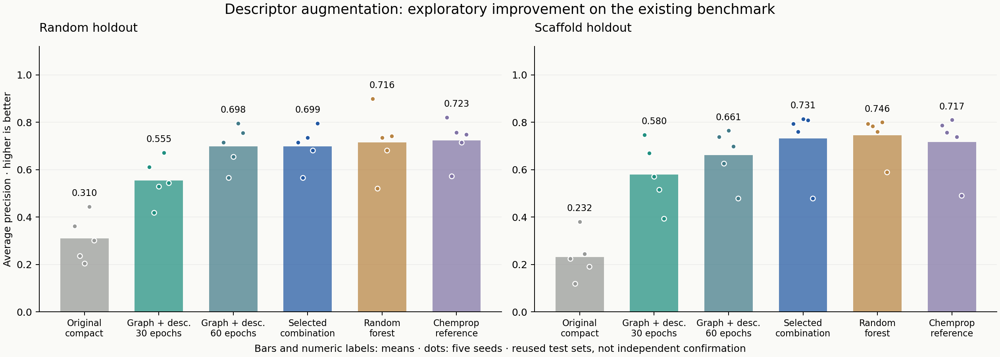

# Compact model improvement: exploratory results

Adding molecular descriptors to the compact graph model under its existing 30-epoch budget changed mean average precision by **+0.245 on random splits** and **+0.347 on scaffold splits** relative to the original compact model.

These are development results on an already inspected benchmark, not independent confirmation or an improvement claim over the original paper. Every candidate and combination rule was written down before this experiment, and all ten validation-based choices were locked before any new test prediction.

## What changed

- **fusion_30:** retain the original width-64 graph backbone and training schedule; add 200 normalized molecular descriptors to its prediction head.
- **fusion_60:** the same augmented architecture with 60 epochs, constant learning rate 0.001 and weight decay 0.00001. This changes both duration and optimizer settings.
- **descriptor_mlp:** descriptor-only comparison, allowing inspection of whether the graph adds value.
- **selected_blend:** choose the neural candidate and its combination weight with the frozen random forest using validation AP only. Weights tested: 0, 0.25, 0.5, 0.75, 1. This has a larger selection budget than fixed baselines; 3/10 choices used the forest alone. It must not be described as a uniformly improved standalone neural model.

Same 2,292 curated compounds, ten original partitions, and seeds [101, 202, 303, 404, 505]. Each test set has 229 compounds and 12 active labels. The descriptor normalization/missing-value treatment, chemistry, labels and splits are unchanged. See [the fixed experiment protocol](../../docs/IMPROVEMENT_PROTOCOL.md).

## All held-out results

| Split | Model | AP | ROC-AUC | P@20 |
| --- | --- | --- | --- | --- |
| random | Class prior | 0.052 ± 0.000 | 0.500 ± 0.000 | 0.052 ± 0.000 |
| random | Original compact | 0.310 ± 0.097 | 0.744 ± 0.099 | 0.330 ± 0.104 |
| random | Descriptors only | 0.537 ± 0.054 | 0.874 ± 0.046 | 0.340 ± 0.065 |
| random | Compact + descriptors (30 epochs) | 0.555 ± 0.095 | 0.851 ± 0.056 | 0.360 ± 0.074 |
| random | Compact + descriptors (60 epochs) | 0.698 ± 0.090 | 0.914 ± 0.069 | 0.460 ± 0.042 |
| random | Validation-selected combination | 0.699 ± 0.085 | 0.896 ± 0.049 | 0.430 ± 0.045 |
| random | Fixed random forest | 0.716 ± 0.136 | 0.906 ± 0.050 | 0.420 ± 0.091 |
| random | Chemprop reference | 0.723 ± 0.092 | 0.892 ± 0.089 | 0.450 ± 0.035 |
| scaffold | Class prior | 0.052 ± 0.000 | 0.500 ± 0.000 | 0.052 ± 0.000 |
| scaffold | Original compact | 0.232 ± 0.096 | 0.767 ± 0.143 | 0.230 ± 0.097 |
| scaffold | Descriptors only | 0.524 ± 0.158 | 0.867 ± 0.078 | 0.390 ± 0.096 |
| scaffold | Compact + descriptors (30 epochs) | 0.580 ± 0.137 | 0.870 ± 0.091 | 0.420 ± 0.104 |
| scaffold | Compact + descriptors (60 epochs) | 0.661 ± 0.115 | 0.928 ± 0.051 | 0.420 ± 0.084 |
| scaffold | Validation-selected combination | 0.731 ± 0.143 | 0.923 ± 0.049 | 0.430 ± 0.084 |
| scaffold | Fixed random forest | 0.746 ± 0.089 | 0.932 ± 0.033 | 0.450 ± 0.061 |
| scaffold | Chemprop reference | 0.717 ± 0.129 | 0.933 ± 0.043 | 0.420 ± 0.097 |

Mean ± sample SD across five seeds; SD is not a confidence interval. AP is scikit-learn average precision. P@20 handles boundary ties. Scores are uncalibrated. Repeated tests reuse compounds; random and scaffold test cohorts differ. The original compact, forest, Chemprop and class-prior values are frozen benchmark results.

## Paired differences on identical test compounds

Positive ΔAP favors the candidate. Negative results and all three standalone candidate settings are retained. The primary comparison is fusion_30 versus original compact. The descriptors-only comparison helps avoid assuming the graph caused all of the gain.

| Split | Candidate | Baseline | Mean ΔAP | SD | Positive differences |
| --- | --- | --- | --- | --- | --- |
| random | Compact + descriptors (30 epochs) | Original compact | +0.245 | 0.051 | 5/5 |
| random | Compact + descriptors (60 epochs) | Original compact | +0.388 | 0.059 | 5/5 |
| random | Validation-selected combination | Original compact | +0.389 | 0.121 | 5/5 |
| random | Compact + descriptors (30 epochs) | Chemprop reference | -0.167 | 0.074 | 0/5 |
| random | Compact + descriptors (60 epochs) | Chemprop reference | -0.025 | 0.079 | 2/5 |
| random | Validation-selected combination | Chemprop reference | -0.024 | 0.055 | 1/5 |
| random | Validation-selected combination | Fixed random forest | -0.017 | 0.097 | 2/5 |
| random | Compact + descriptors (30 epochs) | Descriptors only | +0.019 | 0.060 | 3/5 |
| scaffold | Compact + descriptors (30 epochs) | Original compact | +0.347 | 0.176 | 5/5 |
| scaffold | Compact + descriptors (60 epochs) | Original compact | +0.429 | 0.095 | 5/5 |
| scaffold | Validation-selected combination | Original compact | +0.499 | 0.140 | 5/5 |
| scaffold | Compact + descriptors (30 epochs) | Chemprop reference | -0.137 | 0.088 | 0/5 |
| scaffold | Compact + descriptors (60 epochs) | Chemprop reference | -0.056 | 0.044 | 0/5 |
| scaffold | Validation-selected combination | Chemprop reference | +0.014 | 0.032 | 4/5 |
| scaffold | Validation-selected combination | Fixed random forest | -0.014 | 0.061 | 2/5 |
| scaffold | Compact + descriptors (30 epochs) | Descriptors only | +0.056 | 0.076 | 4/5 |

`paired_differences.csv` includes individual seeds and all four metrics; lower Brier is better. These are descriptive differences without a statistical superiority claim.

## Validation decisions fixed before test evaluation

| Partition | Neural candidate | Neural weight | Validation AP |
| --- | --- | --- | --- |
| random_101 | fusion_60 | 1.0 | 0.766 |
| random_202 | fusion_60 | 1.0 | 0.704 |
| random_303 | fusion_60 | 0.0 | 0.611 |
| random_404 | fusion_60 | 0.0 | 0.663 |
| random_505 | fusion_60 | 0.5 | 0.747 |
| scaffold_101 | fusion_60 | 0.0 | 0.738 |
| scaffold_202 | fusion_60 | 0.75 | 0.475 |
| scaffold_303 | fusion_60 | 0.25 | 0.868 |
| scaffold_404 | fusion_60 | 0.75 | 0.409 |
| scaffold_505 | fusion_60 | 1.0 | 0.761 |

There are only 12 validation positives per split. Candidate/checkpoint/weight selection can overfit this small validation sample. It can therefore underperform a fixed baseline on test data despite a better validation score.

## Verification and provenance

All 30 new models were saved/reloaded and their validation predictions reproduced exactly. The report rechecks selection decisions against saved validation predictions, model/protocol/source/environment hashes, split integrity, all 80 metric rows and all 18,320 saved prediction rows. Neural predictions are restored to their original float32 dtype for metric arithmetic; combinations and forests use float64.

The new head and training orchestration are project-specific AI-assisted code. D-MPNNs, descriptor augmentation and score averaging are established methods. RDKit, descriptastorus, scikit-learn, PyTorch and the Chemprop feature-handling/reference APIs remain attributed third-party software. See [code provenance](../../docs/CODE_PROVENANCE.md) and [third-party notices](../../THIRD_PARTY_NOTICES.md).

## Scope of the result

This experiment improves or tests an internal model configuration, not clinical efficacy or discovery of a new drug. It does not reproduce the paper's original optimized setup. An untouched, compatible external assay and sensitivity checks are still needed before generalization or publication-level superiority claims. Dataset redistribution rights and the project's outbound licensing decision remain unresolved.

Only aggregate outputs are included here. Compound data, descriptors, validation/test predictions and checkpoints stay local and are excluded from the source archive.
