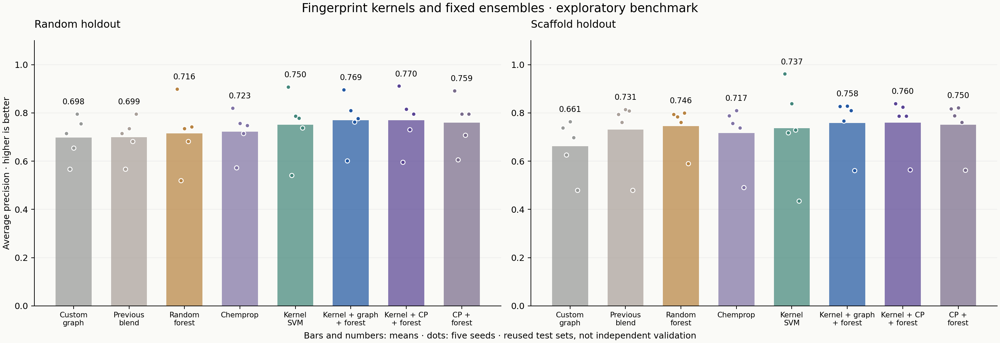

# Fingerprint kernels and fixed ensembles: exploratory results

The predeclared primary comparison, **multiscale Tanimoto SVM versus the fixed forest on scaffold AP**, changed by **-0.009** on average, with positive differences in **2/5** seeds. All five new candidates and all eight prior model families are retained below, regardless of outcome.

This is development on the same previously inspected benchmark. It is not independent confirmation, statistical proof of superiority, or a comparison with Stokes' original optimized model. The full [predeclared protocol](../../docs/KERNEL_PROTOCOL.md) records the research sources and selection budget.

## Research translated into the experiment

- [Yang et al. (2019)](https://pmc.ncbi.nlm.nih.gov/articles/PMC6727618/) motivates molecular features and model averaging. We retain the prior graph models and investigate heterogeneous equal-weight ensembles; these combinations are our experimental choices.
- [Tripp et al. (2023)](https://arxiv.org/abs/2306.14809) studies Tanimoto kernels for molecular learning. We implement the established exact binary kernel, which fits this dataset's size, rather than reproducing their random-feature approximation.
- [Cawley and Talbot (2010)](https://www.jmlr.org/papers/v11/cawley10a.html) explains overfitting during model selection. We restrict kernel tuning to three grouped inner folds and lock all choices before a separate test-scoring command.

## What changed

Two SVMs use radius-2 Morgan similarity or the fixed mean of radius-2/radius-3 similarities. Each uses an eight-setting C/class-weight grid, selected by mean training-only inner-fold AP. Connectivity/scaffold groups stay together as appropriate. The three inner folds contain 23–45 positives in this run; the former outer validation sets have just 12. Group sizes still differ, especially for scaffold folds.

Each selected SVM is refitted on all original training rows. A regularized logistic calibration is fitted to its out-of-fold training decisions. Calibration and hyperparameter selection reuse those folds, so CV results are selection diagnostics, not independent estimates. Neither outer validation nor test labels tune the new kernel. Existing neural checkpoints retain their previous validation-based selection.

Three fixed, equal-weight arithmetic means combine: (a) kernel/custom graph/forest, (b) kernel/Chemprop/forest, and (c) Chemprop/forest. The third is a control for whether the kernel adds to a simpler reference ensemble. No ensemble weights were fitted. These ensembles have greater combined model and optimization budgets than any single fixed baseline.

## Complete results

| Split | Model | AP | ROC-AUC | P@20 |
| --- | --- | --- | --- | --- |
| random | Class prior | 0.052 ± 0.000 | 0.500 ± 0.000 | 0.052 ± 0.000 |
| random | Original compact | 0.310 ± 0.097 | 0.744 ± 0.099 | 0.330 ± 0.104 |
| random | Descriptors only | 0.537 ± 0.054 | 0.874 ± 0.046 | 0.340 ± 0.065 |
| random | Compact + descriptors (30 epochs) | 0.555 ± 0.095 | 0.851 ± 0.056 | 0.360 ± 0.074 |
| random | Compact + descriptors (60 epochs) | 0.698 ± 0.090 | 0.914 ± 0.069 | 0.460 ± 0.042 |
| random | Validation-selected combination | 0.699 ± 0.085 | 0.896 ± 0.049 | 0.430 ± 0.045 |
| random | Fixed random forest | 0.716 ± 0.136 | 0.906 ± 0.050 | 0.420 ± 0.091 |
| random | Chemprop reference | 0.723 ± 0.092 | 0.892 ± 0.089 | 0.450 ± 0.035 |
| random | Tanimoto SVM (radius 2) | 0.748 ± 0.137 | 0.909 ± 0.075 | 0.460 ± 0.082 |
| random | Tanimoto SVM (radii 2 + 3) | 0.750 ± 0.133 | 0.918 ± 0.072 | 0.480 ± 0.076 |
| random | Kernel + custom graph + forest | 0.769 ± 0.107 | 0.926 ± 0.066 | 0.470 ± 0.057 |
| random | Kernel + Chemprop + forest | 0.770 ± 0.117 | 0.923 ± 0.071 | 0.460 ± 0.065 |
| random | Chemprop + forest | 0.759 ± 0.108 | 0.918 ± 0.067 | 0.460 ± 0.065 |
| scaffold | Class prior | 0.052 ± 0.000 | 0.500 ± 0.000 | 0.052 ± 0.000 |
| scaffold | Original compact | 0.232 ± 0.096 | 0.767 ± 0.143 | 0.230 ± 0.097 |
| scaffold | Descriptors only | 0.524 ± 0.158 | 0.867 ± 0.078 | 0.390 ± 0.096 |
| scaffold | Compact + descriptors (30 epochs) | 0.580 ± 0.137 | 0.870 ± 0.091 | 0.420 ± 0.104 |
| scaffold | Compact + descriptors (60 epochs) | 0.661 ± 0.115 | 0.928 ± 0.051 | 0.420 ± 0.084 |
| scaffold | Validation-selected combination | 0.731 ± 0.143 | 0.923 ± 0.049 | 0.430 ± 0.084 |
| scaffold | Fixed random forest | 0.746 ± 0.089 | 0.932 ± 0.033 | 0.450 ± 0.061 |
| scaffold | Chemprop reference | 0.717 ± 0.129 | 0.933 ± 0.043 | 0.420 ± 0.097 |
| scaffold | Tanimoto SVM (radius 2) | 0.748 ± 0.172 | 0.924 ± 0.052 | 0.460 ± 0.114 |
| scaffold | Tanimoto SVM (radii 2 + 3) | 0.737 ± 0.195 | 0.925 ± 0.066 | 0.450 ± 0.132 |
| scaffold | Kernel + custom graph + forest | 0.758 ± 0.113 | 0.942 ± 0.033 | 0.450 ± 0.071 |
| scaffold | Kernel + Chemprop + forest | 0.760 ± 0.112 | 0.943 ± 0.029 | 0.470 ± 0.045 |
| scaffold | Chemprop + forest | 0.750 ± 0.108 | 0.941 ± 0.025 | 0.470 ± 0.045 |

Mean ± sample SD over five seeds; SD is not a confidence interval. AP is average precision, not trapezoidal PR-AUC. Higher AP, ROC-AUC and P@20 are better; lower Brier score is better. All Brier values are retained in the CSVs. Each test has 229 compounds and 12 positives. Test sets overlap across seeds, and random/scaffold cohorts differ.

## Paired comparisons on identical test compounds

| Split | Candidate | Baseline | Mean ΔAP | SD | Positive differences |
| --- | --- | --- | --- | --- | --- |
| random | Tanimoto SVM (radius 2) | Fixed random forest | +0.032 | 0.047 | 3/5 |
| random | Tanimoto SVM (radius 2) | Chemprop reference | +0.025 | 0.064 | 2/5 |
| random | Tanimoto SVM (radii 2 + 3) | Fixed random forest | +0.035 | 0.040 | 4/5 |
| random | Tanimoto SVM (radii 2 + 3) | Chemprop reference | +0.028 | 0.049 | 3/5 |
| random | Kernel + custom graph + forest | Fixed random forest | +0.054 | 0.037 | 4/5 |
| random | Kernel + custom graph + forest | Chemprop reference | +0.047 | 0.020 | 5/5 |
| random | Kernel + Chemprop + forest | Fixed random forest | +0.054 | 0.027 | 5/5 |
| random | Kernel + Chemprop + forest | Chemprop reference | +0.047 | 0.030 | 5/5 |
| random | Chemprop + forest | Fixed random forest | +0.043 | 0.036 | 4/5 |
| random | Chemprop + forest | Chemprop reference | +0.036 | 0.029 | 4/5 |
| random | Tanimoto SVM (radii 2 + 3) | Tanimoto SVM (radius 2) | +0.002 | 0.032 | 2/5 |
| random | Kernel + custom graph + forest | Validation-selected combination | +0.070 | 0.073 | 4/5 |
| random | Kernel + Chemprop + forest | Chemprop + forest | +0.011 | 0.015 | 4/5 |
| scaffold | Tanimoto SVM (radius 2) | Fixed random forest | +0.002 | 0.096 | 2/5 |
| scaffold | Tanimoto SVM (radius 2) | Chemprop reference | +0.031 | 0.062 | 3/5 |
| scaffold | Tanimoto SVM (radii 2 + 3) | Fixed random forest | -0.009 | 0.129 | 2/5 |
| scaffold | Tanimoto SVM (radii 2 + 3) | Chemprop reference | +0.020 | 0.092 | 2/5 |
| scaffold | Kernel + custom graph + forest | Fixed random forest | +0.013 | 0.039 | 3/5 |
| scaffold | Kernel + custom graph + forest | Chemprop reference | +0.042 | 0.029 | 5/5 |
| scaffold | Kernel + Chemprop + forest | Fixed random forest | +0.015 | 0.038 | 3/5 |
| scaffold | Kernel + Chemprop + forest | Chemprop reference | +0.043 | 0.022 | 5/5 |
| scaffold | Chemprop + forest | Fixed random forest | +0.005 | 0.040 | 3/5 |
| scaffold | Chemprop + forest | Chemprop reference | +0.034 | 0.023 | 5/5 |
| scaffold | Tanimoto SVM (radii 2 + 3) | Tanimoto SVM (radius 2) | -0.011 | 0.044 | 2/5 |
| scaffold | Kernel + custom graph + forest | Validation-selected combination | +0.027 | 0.033 | 5/5 |
| scaffold | Kernel + Chemprop + forest | Chemprop + forest | +0.010 | 0.012 | 4/5 |

Every seed and all four metrics appear in `paired_differences.csv`. Gains in one metric need not imply gains in every metric or partition. The radius-2 ablation and two-component ensemble control are retained even if they outperform the more complex alternatives. Do not select a new default based solely on these reused test results.

## Training-only choices

| Partition | Model | C | Class weight | Training CV AP |
| --- | --- | --- | --- | --- |
| random_101 | kernel_r2 | 10.0 | balanced | 0.603 |
| random_101 | kernel_multiscale | 10.0 | None | 0.601 |
| random_202 | kernel_r2 | 10.0 | balanced | 0.701 |
| random_202 | kernel_multiscale | 10.0 | None | 0.706 |
| random_303 | kernel_r2 | 1.0 | None | 0.594 |
| random_303 | kernel_multiscale | 10.0 | balanced | 0.595 |
| random_404 | kernel_r2 | 1.0 | balanced | 0.627 |
| random_404 | kernel_multiscale | 1.0 | balanced | 0.633 |
| random_505 | kernel_r2 | 1.0 | balanced | 0.591 |
| random_505 | kernel_multiscale | 1.0 | balanced | 0.590 |
| scaffold_101 | kernel_r2 | 100.0 | None | 0.485 |
| scaffold_101 | kernel_multiscale | 10.0 | balanced | 0.478 |
| scaffold_202 | kernel_r2 | 0.1 | None | 0.541 |
| scaffold_202 | kernel_multiscale | 0.1 | None | 0.542 |
| scaffold_303 | kernel_r2 | 1.0 | None | 0.491 |
| scaffold_303 | kernel_multiscale | 1.0 | None | 0.497 |
| scaffold_404 | kernel_r2 | 1.0 | None | 0.570 |
| scaffold_404 | kernel_multiscale | 1.0 | None | 0.563 |
| scaffold_505 | kernel_r2 | 10.0 | balanced | 0.535 |
| scaffold_505 | kernel_multiscale | 10.0 | balanced | 0.544 |

All 20 kernel fits were serialized and reloaded with exactly reproduced validation predictions. Training-fold membership, all eight candidates' out-of-fold scores, selected settings, calibration parameters and component checkpoints remain in the local run. A single lock covers all ten partitions before evaluation.

## Verification and interpretation

The report verifies all 130 metric rows, 29,770 prediction rows, 30 ensemble outputs, 20 selection decisions, training group isolation, original test membership/labels, and source/protocol/environment/artifact hashes. The evaluator additionally checks executing source against its frozen snapshot and reproduces the three old component models' test predictions before combining them. Prior evaluation results are carried forward unchanged.

No new packages, pretrained weights, paper figures or third-party implementation files were added. The kernel formula, wrappers, experiments and tests were generated here with AI assistance; scikit-learn supplies SVM/logistic estimators, RDKit supplies fingerprints, and Chemprop remains an explicitly attributed reference implementation. These are established methods, not a claim of a newly invented algorithm. See [code provenance](../../docs/CODE_PROVENANCE.md).

The data, benchmark reuse, overlapping cohorts, greedy scaffold allocation and external descriptor normalization remain limitations. Training-only sigmoid calibration does not establish calibrated probabilities outside this assay. A compatible untouched external assay and prospective laboratory validation remain outstanding. No new drug or clinical benefit is established. Only aggregate results are included in this report; molecular data, predictions and trained models remain excluded from the source bundle.
