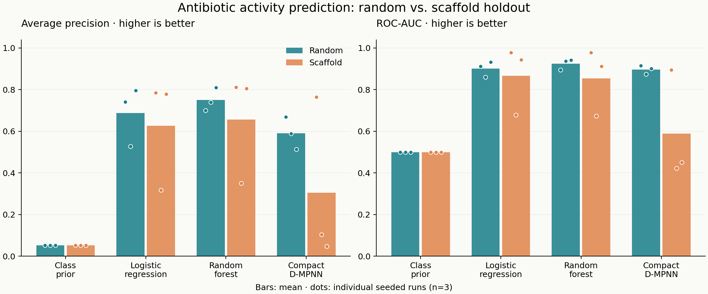

# Pilot results: molecular generalization

Generated from completed run `pilot-v2`. This is a computational extension of Stokes et al. (2020), not an exact reproduction or a validated drug discovery.

## Data and evaluation

- Source: [publisher Table S1](https://ars.els-cdn.com/content/image/1-s2.0-S0092867420301021-mmc1.xlsx), sheet S1B; SHA-256 `a75e9546c5af35c6eee29bbaa0a9e36fe97cb346b3f2c614e590d31962410a31`.
- Original: 2335 molecules / 120 active. Curated: 2292 molecules / 119 active.
- Seeds fixed in advance: [11, 22, 33]. Each model shares the same partitions within a split and seed.
- Split protocol: One greedy group allocation balancing 80/10/10 row and positive counts; seed perturbs group priority by Uniform(0.8,1.2). No score-based split selection. Preflight: >=150 rows and >=5 positives per validation/test partition. Inspect each `split_summary.json` for actual counts.
- Random split groups connectivity-equivalent molecules. Scaffold split groups Bemis–Murcko frameworks, including one shared acyclic group. This prevents exact group overlap, not every possible form of chemical similarity.
- Hyperparameters and D-MPNN checkpoint selection use validation AP only. Models are not refitted on the test set.

## Held-out performance

| Split | Model | AP | ROC-AUC | P@20 |
| --- | --- | --- | --- | --- |
| random | Class prior | 0.052 ± 0.000 | 0.500 ± 0.000 | 0.052 ± 0.000 |
| random | Logistic regression | 0.688 ± 0.141 | 0.902 ± 0.038 | 0.467 ± 0.029 |
| random | Random forest | 0.750 ± 0.056 | 0.925 ± 0.026 | 0.467 ± 0.058 |
| random | Compact D-MPNN | 0.590 ± 0.078 | 0.897 ± 0.021 | 0.433 ± 0.029 |
| scaffold | Class prior | 0.052 ± 0.000 | 0.500 ± 0.000 | 0.052 ± 0.000 |
| scaffold | Logistic regression | 0.627 ± 0.268 | 0.867 ± 0.164 | 0.367 ± 0.189 |
| scaffold | Random forest | 0.656 ± 0.265 | 0.854 ± 0.160 | 0.400 ± 0.173 |
| scaffold | Compact D-MPNN | 0.305 ± 0.399 | 0.589 ± 0.265 | 0.183 ± 0.236 |

Values show mean ± sample standard deviation across 3 seeds, not confidence intervals. Test compounds overlap between seeds, so these are not independent replications. AP means scikit-learn average precision, not trapezoidal PR-AUC. P@20 averages ties at the ranking boundary; the class-prior baseline therefore has P@20 equal to test prevalence.

## Interpretation limits

This pilot has small, imbalanced test sets. Inspect positive counts before comparing scores. Random and scaffold splits may differ in size and prevalence, affecting AP. A performance difference here does not alone prove an architecture is superior or quantify a universal distribution-shift penalty.

The graph model is a compact, independently implemented D-MPNN with mean pooling, no RDKit descriptor augmentation, no ensembling, and a small training budget. It is not the original Chemprop model. Logistic regression tries three C values and random forest two leaf sizes; the graph model uses one fixed architecture with validation checkpoint selection. Tuning budgets are not matched. Scores are uncalibrated.

`similarity_error_analysis.csv` groups held-out predictions by maximum Morgan-fingerprint Tanimoto similarity to training data. Rows combine seeds, so repeated compounds are counted more than once; both prediction and unique-compound counts are included. Use this as descriptive error analysis, not independent statistical evidence.

## Audit trail

- `run.json`: data checksum, package versions, source-code hashes, configuration, completion status.
- `metrics.csv`: each seed/model result, validation AP and runtime.
- `predictions.csv`: every held-out label, score and nearest-training similarity.
- Per-split folders: exact membership, class counts, model artifacts, validation search/training history.
- Dataset preparation creates `data/processed/curation_audit.csv` with every rejected or merged source row.

## Next experiment

Freeze this pilot. Before claiming a model improvement, predeclare a larger repeated-split study, matched tuning budgets, chemical-standardization sensitivity analysis, and an untouched external evaluation set with compatible assay labels. An additional bootstrap over these reused test molecules would not substitute for independent validation.
