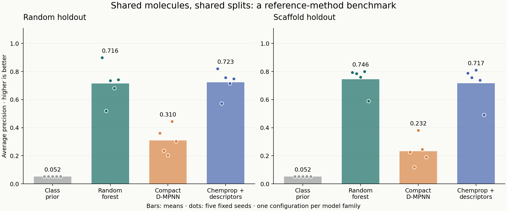

# Shared-split reference comparison

The compact project model versus the licensed Chemprop reference: **random mean ΔAP -0.413; scaffold mean ΔAP -0.484**. These are internal benchmark differences, not evidence of an improvement over the paper's published result or a new drug discovery.

## Fixed experiment

- Run: `reference-v1-1`; protocol `shared-split-reference-v1.1`; five seeds [101, 202, 303, 404, 505].
- Same curated Table S1B as the pilot: 2,292 molecules, 119 active. Each model receives the same train/validation/test membership within each split and seed.
- One configuration per model family. Both neural networks train for 30 complete epochs under the same optimizer schedule; validation AP selects their checkpoints. Models differ in size, features and regularization. Equal configuration counts do not mean equal computational cost or optimization quality.
- Reference: Chemprop 1.6.1, hidden size 300, directed bond messages, depth 3, mean pooling and 200 normalized RDKit descriptors. The project compact model uses hidden size 64 without descriptors. The fixed 500-tree forest differs from the class-weighted, tuned pilot forest.
- 44 NaN descriptor cells across 11 molecules were replaced by zero using Chemprop's native policy; no fitted imputation or label-dependent curation.
- Exact membership is retained locally. Aggregate partition counts are in `split_counts.json`. Unique test compounds across the five seeds: random **919** (including 48 active), scaffold **828** (including 38 active). The seeds reuse compounds and are not independent external cohorts.

## Held-out results

| Split | Model | AP | ROC-AUC | P@20 |
| --- | --- | --- | --- | --- |
| random | Class prior | 0.052 ± 0.000 | 0.500 ± 0.000 | 0.052 ± 0.000 |
| random | Random forest (500 trees) | 0.716 ± 0.136 | 0.906 ± 0.050 | 0.420 ± 0.091 |
| random | Project compact D-MPNN | 0.310 ± 0.097 | 0.744 ± 0.099 | 0.330 ± 0.104 |
| random | Chemprop + descriptors | 0.723 ± 0.092 | 0.892 ± 0.089 | 0.450 ± 0.035 |
| scaffold | Class prior | 0.052 ± 0.000 | 0.500 ± 0.000 | 0.052 ± 0.000 |
| scaffold | Random forest (500 trees) | 0.746 ± 0.089 | 0.932 ± 0.033 | 0.450 ± 0.061 |
| scaffold | Project compact D-MPNN | 0.232 ± 0.096 | 0.767 ± 0.143 | 0.230 ± 0.097 |
| scaffold | Chemprop + descriptors | 0.717 ± 0.129 | 0.933 ± 0.043 | 0.420 ± 0.097 |

Values are mean ± sample SD across seeds, not confidence intervals. AP is average precision, not trapezoidal PR-AUC. Test sets are small and imbalanced; class prior provides the prevalence-dependent ranking baseline. P@20 uses tie averaging.

## Paired comparison on identical test compounds

Positive ΔAP favors the named model; negative ΔAP favors Chemprop. Individual differences follow the seed order above. These are descriptive values, with no independence assumption, statistical significance claim or external-validation claim.

| Split | Model minus Chemprop | Mean ΔAP | SD of ΔAP | Positive differences | Individual ΔAP |
| --- | --- | --- | --- | --- | --- |
| random | Project compact D-MPNN | -0.413 | 0.110 | 0/5 | -0.458, -0.336, -0.552, -0.270, -0.446 |
| random | Random forest (500 trees) | -0.007 | 0.051 | 1/5 | +0.079, -0.052, -0.021, -0.033, -0.007 |
| scaffold | Project compact D-MPNN | -0.484 | 0.129 | 0/5 | -0.563, -0.638, -0.429, -0.493, -0.300 |
| scaffold | Random forest (500 trees) | +0.029 | 0.056 | 4/5 | +0.006, +0.027, -0.049, +0.061, +0.098 |

`paired_differences.csv` also includes ROC-AUC, P@20 and Brier differences. For Brier, lower is better. `metrics.csv` retains runtimes and neural parameter counts.

## What this says about the paper

Stokes et al. report random-split ROC-AUC around 0.896 under their own sample and protocol. Here, standardization reduces the dataset, partitions differ, the reference software postdates the paper, architecture search/ensembling are omitted, and the trainer selects validation AP. Our new comparison is internally matched; it is **not a replication of the published optimized model**. A score above 0.896 cannot be called an improvement over that paper.

The study still lacks an untouched, compatible external assay cohort. The label-aware allocation and treatment of acyclic molecules also limit generalization. Standardization sensitivity and external evaluation remain necessary before broader claims.

Random and scaffold experiments hold out different test cohorts. A higher scaffold mean in these particular runs does not show that unfamiliar chemistry is inherently easier, just as a lower mean would not isolate a universal distribution-shift penalty. The within-split, paired model differences are the more controlled comparisons.

The compact model's learning-rate schedule, batch size and checkpoint budget changed from the pilot so the two neural implementations could share a training recipe. Its new score should not be compared with the old pilot as an isolated model improvement or regression: the seeds and training recipe both changed. This fixed-configuration experiment also cannot identify whether differences arise from model size, descriptors, molecular features or optimization. A subsequent controlled ablation would need to vary those factors separately and keep newly observed test scores out of its selection decisions.

## Verification and provenance

The report generator revalidated all ten splits, matched every model's held-out compound IDs/labels, recomputed all metrics from saved predictions, and verified frozen protocol/source/environment/split hashes. Each of the 30 fitted models was saved, reloaded and checked against its original predictions during the run. The failed descriptor-only preflight is preserved separately; it produced no fitted models or test scores.

Only aggregate results are included in this report snapshot. Raw data, molecular predictions, descriptor arrays and checkpoints remain local. For implementation authorship and license scope, see [code provenance](../../docs/CODE_PROVENANCE.md) and [third-party notices](../../THIRD_PARTY_NOTICES.md).

Sources: [Stokes et al. (2020)](https://doi.org/10.1016/j.cell.2020.01.021), [Chemprop](https://github.com/chemprop/chemprop), [Yang et al. (2019)](https://doi.org/10.1021/acs.jcim.9b00237).
